[](https://gitpod.io/#https://github.com/JaleneA/SCT-JaleneA)


# Student Conduct Tracker
Staff System For Recording Positive & Negative Experiences With Students.


## Project Requirements
* Add Student
* Review Student
* Search Student
* View Student Reviews


## Dependencies
* Python3/pip3
* Packages listed in requirements.txt


## Installing Dependencies
```bash
$ pip install -r requirements.txt
```


## Flask MVC
This flask application is structured using the Model View Controller pattern


## Initializing the Database
When connecting the project to a fresh empty database ensure the appropriate configuration is set then file then run the following command.


```bash
$ flask init
```


## Flask Commands
wsgi.py is a utility script for performing various tasks related to the project.


### Admin Commands
```bash
# Creating a Staff Account (inline)
$ flask admin create_staff Mrs. Bubble Bub bubble.bub@staff.com N bubblepass 1
```

```bash
# Creating a Staff Account (interactive input)
$ flask admin create_staff 
```

```bash
# List All Staff Accounts
$ flask admin list_staff 
```
<details>
<summary>Snippets</summary>


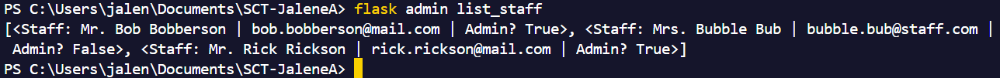

</details>


### Staff Commands
```bash
# Adding a Student Record (inline)
$ flask staff add_student 816031000 Bobby Butterbeard bobby.butterbread@mail.com
```

```bash
# Adding a Student Record (interactive input)
$ flask staff add_student
```

```bash
# Adding Multiple Student Records (inline)
$ flask staff add_students students.csv
```

```bash
# Adding Multiple Student Records (interactive input)
$ flask staff add_students
```

```bash
# Reviewing a Student (inline)
$ flask staff review 816031000 Overall Good Student 1
```

```bash
# Reviewing a Student (interactive input)
$ flask staff review
```

```bash
# Viewing Student Reviews (inline only)
$ flask staff view_student_reviews 816031000
```

```bash
# Search Student (inline only)
$ flask staff search_student 816031000
```

```bash
# List All Students
$ flask staff list_students
```

<details>
<summary>Snippets</summary>

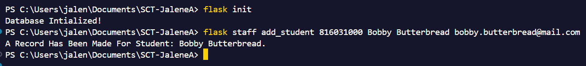
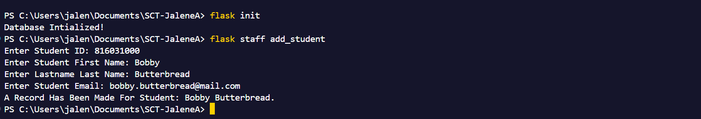
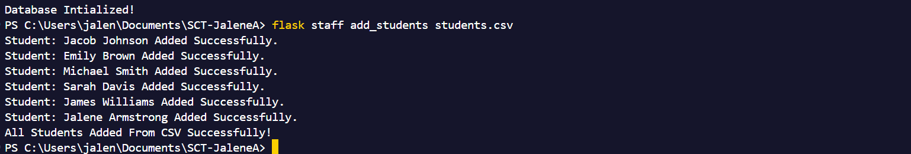
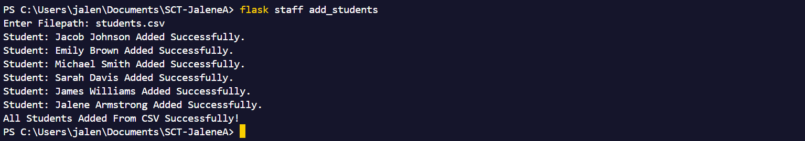

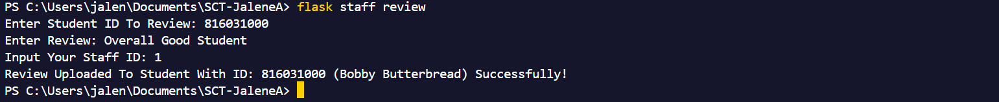
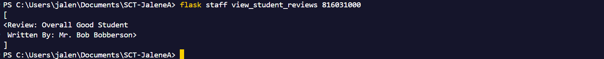
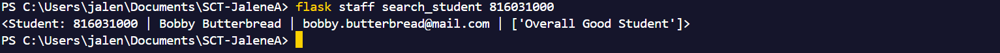
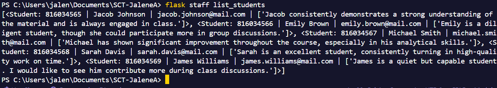

</details>

# Testing

## Unit & Integration
A few (7) Unit and Integration tests are created in the App/test.
You can then execute all user tests as follows:

```bash
$ flask test staff
```

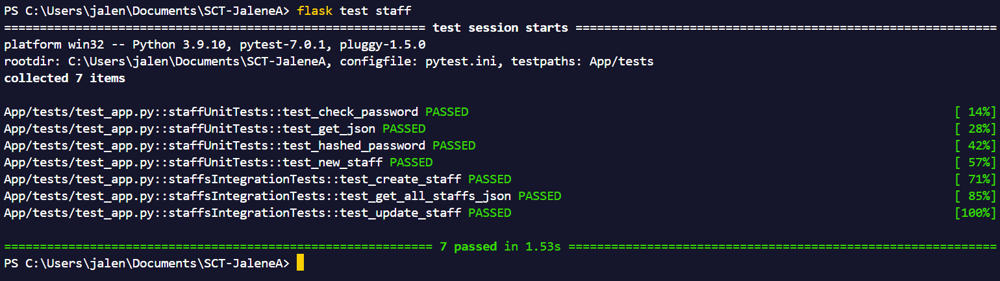

or run all application tests with the following command:

```bash
$ pytest
```

# Error Handling
✓ Another Staff With The Same Email Cannot Be Created<br>
✓ Only Admins Can Create Staff Accounts<br>
✓ Existing Students Import Via CSV Will Be Ignored Upon Later Imports of The Same CSV (With Newly Added Data)<br>
✓ Cannot Create Another Student With An Already Existing Student ID<br>
✓ Cannot Review a Student That Doesn't Exist<br>
✓ Cannot Search a Student That Doesn't Exist<br>


<details>
<summary>Snippets</summary>

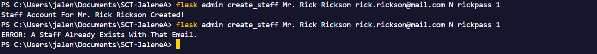
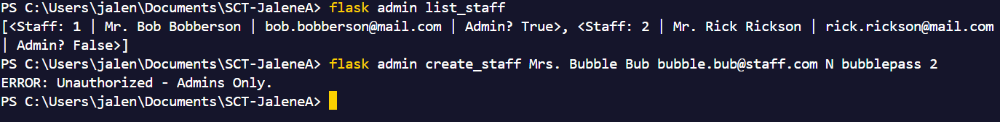
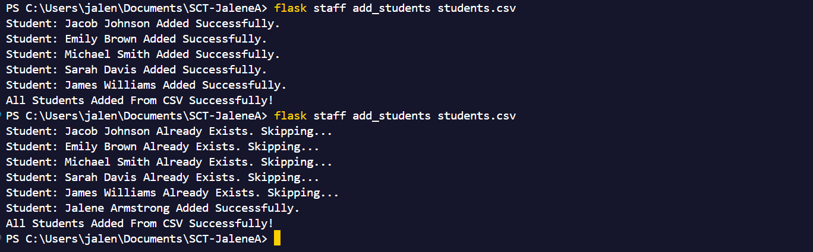
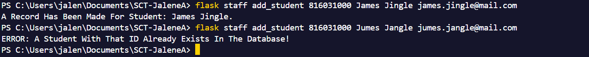


</details>
